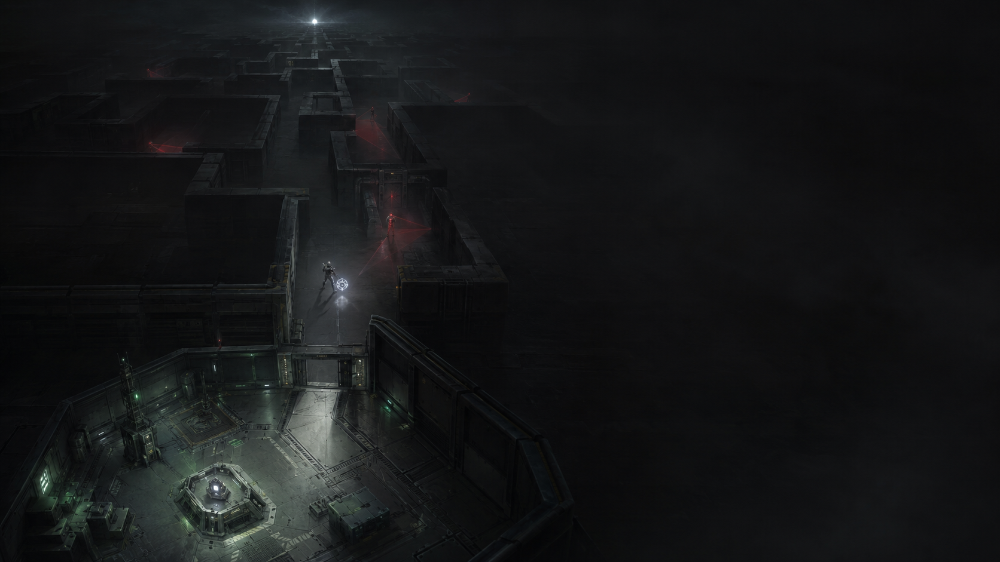

# Far Signal

[Версия на русском](readme_rus.md)

[Play Far Signal in the browser](https://delorum.github.io/FarSignal/)

Far Signal is a top-down 2D exploration and survival game built with Godot
4.7. The player enters a large procedural maze from its lower edge, explores
unknown corridors, fights armed enemies, retrieves megacores, and gradually
extends a safe zone toward the final door at the top of the map.

The game is designed around a compact set of connected systems rather than a
large number of items or abilities: exploration produces resources, combat
opens access to enemy cores, stations convert those resources into supplies
and upgrades, and doors permanently change the structure of the playable
space.

## Gameplay

- Explore a connected `199 x 199` maze with corridors, loops, and rooms.
- Reveal floor cells to earn level-scaled exploration points.
- Fight enemies that react to sight, footsteps, and gunfire, search for lost
  targets, flank, and fire at moving targets with predictive aim.
- Collect energy cores from defeated enemies and exchange them for energy.
- Follow station assignments to find and return megacores for larger rewards.
- Spend energy on health, ammunition, doors, and permanent upgrades.
- Install doors to divide the maze and expand the green safe zone.
- Reach and activate the final door after connecting it to the safe zone.

Doors are limited inventory items. Installation and removal take two seconds
and are interrupted by movement, firing, or taking damage. A door separating
safe and unsafe floor cannot be removed. The starting locked door and the
final door are permanent.

Enemies are divided into five horizontal level zones and become stronger
toward the top of the maze. They patrol within their assigned zone but may
leave it while pursuing the player. Replacement enemies spawn outside a
minimum radius around the player and return to their own zone afterward. As
the safe zone expands and leaves less hostile floor available, the target
enemy count decreases, starting with lower-level enemies.

## Progression

Station 1 is the expedition base. It exchanges enemy cores and exploration
points for energy, accepts returned megacores, sells ammunition and doors,
and restores health. It also provides current expedition statistics.

Stations 2 and 3 are hidden in enemy zones 2 and 4. Each station unlocks two
stages of damage, maximum-health, and ammunition-capacity upgrades. Their
horizontal regions and their positions within the assigned level zones are
randomized for each generated maze.

The map shows explored terrain, safe zones, doors, discovered stations,
uncollected enemy cores, level boundaries, and the active megacore. A marker
can be placed on explored floor; the route to it is drawn through known cells
and refreshed periodically. Selecting an explored safe cell while the player
is already inside the safe zone performs instant travel.

## Controls

- `WASD` or arrow keys: move; scroll the map while it is open
- Left mouse button: fire
- Right mouse button: install or remove a door
- `E`: open or close a nearby door; interact with a station
- `Tab`: open or close the map
- Right mouse button on the map: place or remove a marker; fast travel between
  safe cells
- `Esc`: pause, close the current screen, or return to the previous menu

## Saving

The game can be saved only while the player is inside the safe zone. Outside
it, the pause menu offers only `Delete Game and Exit`. This deletes the entire
current game: it cannot be continued, and the next game must start from the
beginning.

Desktop builds store `far_signal_save.json` next to the executable. Editor
runs store it in the project directory. Web builds use Godot's `user://`
storage backed by the browser. Save formats are intentionally versioned
without backward-compatibility guarantees while the game is in development.

## Running

1. Install Godot 4.7.
2. Open this directory as a Godot project.
3. Run the project with `F6` or `F5`.

The project starts at the main menu and supports Linux, Windows, and Web export
presets. Exported desktop builds use borderless fullscreen; the gameplay
viewport, camera, and HUD adapt to the available resolution. Debug performance
metrics can be enabled from the settings menu.
